## Overview



## How to use this repository
```
# 静的解析
tflint

# セキュリティスキャン
tfsec

# ドキュメント生成
cat overview.template.md > README.md
terraform-docs markdown ./ >> README.md
```

## Requirements

| Name | Version |
|------|---------|
| <a name="requirement_aws"></a> [aws](#requirement\_aws) | ~> 4.0 |

## Providers

| Name | Version |
|------|---------|
| <a name="provider_aws"></a> [aws](#provider\_aws) | 4.66.1 |
| <a name="provider_random"></a> [random](#provider\_random) | 3.5.1 |

## Modules

| Name | Source | Version |
|------|--------|---------|
| <a name="module_aurora_postgresql"></a> [aurora\_postgresql](#module\_aurora\_postgresql) | terraform-aws-modules/rds-aurora/aws | 8.1.1 |
| <a name="module_eks"></a> [eks](#module\_eks) | terraform-aws-modules/eks/aws | 19.13.1 |
| <a name="module_kms_secrets_manager_for_rds"></a> [kms\_secrets\_manager\_for\_rds](#module\_kms\_secrets\_manager\_for\_rds) | terraform-aws-modules/kms/aws | 1.5.0 |
| <a name="module_s3_logs"></a> [s3\_logs](#module\_s3\_logs) | terraform-aws-modules/s3-bucket/aws | 3.10.1 |
| <a name="module_vpc"></a> [vpc](#module\_vpc) | terraform-aws-modules/vpc/aws | 4.0.1 |

## Resources

| Name | Type |
|------|------|
| [aws_secretsmanager_secret.aurora_postgresql_master_password](https://registry.terraform.io/providers/hashicorp/aws/latest/docs/resources/secretsmanager_secret) | resource |
| [aws_secretsmanager_secret_version.aurora_postgresql_master_password](https://registry.terraform.io/providers/hashicorp/aws/latest/docs/resources/secretsmanager_secret_version) | resource |
| [random_password.aurora_postgresql_master_password](https://registry.terraform.io/providers/hashicorp/random/latest/docs/resources/password) | resource |
| [aws_caller_identity.current](https://registry.terraform.io/providers/hashicorp/aws/latest/docs/data-sources/caller_identity) | data source |

## Inputs

| Name | Description | Type | Default | Required |
|------|-------------|------|---------|:--------:|
| <a name="input_common_system"></a> [common\_system](#input\_common\_system) | System Name | `string` | n/a | yes |
| <a name="input_vpc_azs"></a> [vpc\_azs](#input\_vpc\_azs) | Availabirity Zone | `list(string)` | n/a | yes |
| <a name="input_vpc_cidr"></a> [vpc\_cidr](#input\_vpc\_cidr) | VPC CIDR | `string` | n/a | yes |
| <a name="input_vpc_database_subnets"></a> [vpc\_database\_subnets](#input\_vpc\_database\_subnets) | Database Subnets CIDR | `list(string)` | n/a | yes |
| <a name="input_vpc_private_subnets"></a> [vpc\_private\_subnets](#input\_vpc\_private\_subnets) | Private Subnets CIDR | `list(string)` | n/a | yes |
| <a name="input_vpc_public_subnets"></a> [vpc\_public\_subnets](#input\_vpc\_public\_subnets) | Public Subnets CIDR | `list(string)` | n/a | yes |

## Outputs

| Name | Description |
|------|-------------|
| <a name="output_aurora_cluster_endpoint"></a> [aurora\_cluster\_endpoint](#output\_aurora\_cluster\_endpoint) | value of aurora cluster endpoint |
| <a name="output_aurora_reader_endpoint"></a> [aurora\_reader\_endpoint](#output\_aurora\_reader\_endpoint) | value of aurora reader endpoint |
| <a name="output_aurora_security_group_id"></a> [aurora\_security\_group\_id](#output\_aurora\_security\_group\_id) | value of aurora security group id |
| <a name="output_s3_logs_bucket_id"></a> [s3\_logs\_bucket\_id](#output\_s3\_logs\_bucket\_id) | value of s3\_logs\_bucket\_id |
| <a name="output_vpc_database_subnets"></a> [vpc\_database\_subnets](#output\_vpc\_database\_subnets) | value of vpc\_database\_subnets |
| <a name="output_vpc_id"></a> [vpc\_id](#output\_vpc\_id) | value of vpc\_id |
| <a name="output_vpc_private_subnets"></a> [vpc\_private\_subnets](#output\_vpc\_private\_subnets) | value of vpc\_private\_subnets |
| <a name="output_vpc_public_subnets"></a> [vpc\_public\_subnets](#output\_vpc\_public\_subnets) | value of vpc\_public\_subnets |
